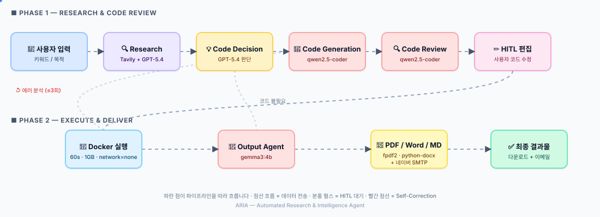

<div align="center">

# 🤖 ARIA
### Automated Research & Intelligence Agent

**키워드 또는 목적을 입력하면**  
**웹 리서치 → 코드 생성 → 실행 검증까지 자동으로 처리하는 멀티 에이전트 시스템**

<br>


</div>

---

## 📌 프로젝트 개요

ARIA는 사용자의 키워드나 목적을 입력받아 리서치와 코드 생성을 자동으로 수행하는 파이프라인 기반 멀티 에이전트 시스템입니다.

- 🔍 최신 웹 정보를 기반으로 리서치 (Tavily advanced, 도메인 무제한, 게시일 포함)
- 🛡️ 검색 결과에 없는 내용은 LLM이 추측하지 않도록 환각 억제 프롬프트 적용
- 🤖 LLM 기반 코드 생성 필요 여부 판단 (리서치 전용 / 코드 생성 분기)
- 🦙 리서치 결과를 컨텍스트로 활용한 코드 자동 생성 (한국어 주석은 `# [설명] ` 접두어로 통일 → HITL 편집 시 식별/검색 용이)
- 🐳 Docker 샌드박스에서 코드를 실행하고 오류 발생 시 Self-Correction
- ⚠️ 에러 분석 내용을 대시보드에서 실시간 확인
- ✏️ Human-in-the-Loop으로 사용자가 직접 코드 편집 후 실행
- 📄 결과물을 PDF / Word / Markdown으로 다운로드 (마크다운 정제 + 한글 폰트)
- 📧 이메일 자동 발송 + 첨부파일 (네이버 SMTP)
- 🕒 실행 히스토리 자동 저장 + 과거 결과 PDF/Word/MD로 다시 다운로드
- ⏰ 스케줄링 자동 실행 (매시간 / 매일 / 매주 / 매월, Asia/Seoul 기준)
- 📂 **멀티스텝 프로젝트 관리** — 한 프로젝트 안에 N개 세션을 누적해 이전 코드/리서치를 다음 실행에 자동 컨텍스트로 전파 (예: 1단계 FastAPI 서버 → 2단계 JWT 인증 → 3단계 DB 연결)

---

## ✨ 일반 AI와의 차별점

| 항목 | 일반 AI (ChatGPT 등) | ARIA |
|---|---|---|
| 코드 실행 | ❌ 사용자가 직접 | ✅ 자동 실행 |
| 오류 수정 | ❌ 수동 재요청 | ✅ Self-Correction 자동 |
| 최신 정보 | ❌ 학습 데이터 한계 | ✅ 실시간 웹 검색 |
| AI 협업 | ❌ 단일 AI | ✅ 3개 AI 역할 분담 |
| 실행 검증 | ❌ 없음 | ✅ Docker 샌드박스 |
| 사용자 개입 | ❌ 없음 | ✅ HITL 코드 직접 편집 |
| 파일 출력 | ❌ 텍스트만 | ✅ PDF / Word / Markdown |
| 이력 보존 | ❌ 세션 종료 시 소실 | ✅ SQLite 영속 저장 |
| 정기 자동 실행 | ❌ 매번 수동 입력 | ✅ APScheduler 스케줄링 |
| 누적 작업 컨텍스트 | ❌ 매번 새 대화 | ✅ 프로젝트 단위 멀티스텝 누적 |

---

## 🏗️ 시스템 아키텍처

<p align="center">
  
</p>

> 💡 파란 점이 파이프라인을 따라 흐르며 데이터 전송을 표현합니다. 분홍 펄스는 HITL 편집 단계, 빨간 점선은 Self-Correction 회귀 경로입니다. (GitHub의 SVG 렌더러는 SMIL 애니메이션을 그대로 재생합니다.)

상세 다이어그램은 [`architecture/`](./architecture/) 폴더를 참고하세요.

### 파이프라인 흐름

```
사용자 입력 (키워드/목적 · 이메일 첨부 형식 선택)
    ↓
① Research Agent   — Tavily 웹 검색 + GPT-5.4 정리 (출처 URL 포함)
    ↓
② Code Decision    — GPT-5.4가 코드 생성 필요 여부 판단
    ↓ (코드 필요 시)
③ Code Agent       — qwen2.5-coder 코드 생성 + 코드 리뷰
                       → ✏️ HITL: 사용자가 코드 직접 편집 가능 (text_area)
                       → 승인 후 Docker 샌드박스 실행
                       → 실패 시 gemma3:4b 에러 분석 → 재생성 (최대 3회)
    ↓
④ Output Agent     — 템플릿 조립 (LLM 호출 없이 실행 결과 + 리서치 섹션 합성)
    ↓
⑤ 파일 변환        — PDF (fpdf2 + NanumGothic) / Word (python-docx) / Markdown
    ↓
⑥ Email Agent      — 요청 시에만 발송 (네이버 SMTP, 본문 + 선택 형식 첨부)
```

---

## 🛠️ 기술 스택

| 분류 | 기술 | 용도 |
|---|---|---|
| **언어** | Python 3.11 | 전체 시스템 구현 |
| **워크플로우** | LangGraph | 파이프라인 + Self-Correction + Checkpointer |
| **웹 검색** | Tavily API | 실시간 웹 검색 (신뢰 도메인 우선) |
| **Cloud LLM** | GPT-5.4 (학교 API) | 리서치 정리, 코드 생성 필요 여부 판단 |
| **Local LLM** | qwen2.5-coder | 코드 생성, 코드 리뷰, 코드 수정 |
| **Local LLM** | gemma3:4b | 에러 분석 (실패 시) |
| **GPU** | NVIDIA RTX 3080 | 로컬 추론 가속 |
| **샌드박스** | Docker | 보안 격리 코드 실행 환경 |
| **UI** | Reflex (React + FastAPI) | 사이드바 기반 대시보드, 실시간 스트리밍 |
| **이메일** | 네이버 SMTP | 결과물 자동 발송 + 첨부 |
| **문서 변환** | fpdf2, python-docx | PDF / Word 파일 생성 (한글 NanumGothic) |
| **스케줄링** | APScheduler | 매시간/매일/매주/매월 백그라운드 실행 (Asia/Seoul) |
| **실행 환경** | WSL2 (Ubuntu 24.04) | 개발 및 배포 환경 |
| **세션 저장** | LangGraph SqliteSaver | Checkpointer 기반 세션 관리 |
| **히스토리** | SQLite (`history.db`) | 모든 실행 결과 영속 저장 |
| **스케줄 저장** | SQLite (`schedule.db`) | 등록된 스케줄 영속 저장 |
| **프로젝트 저장** | SQLite (`projects.db`) | 멀티스텝 프로젝트/세션 누적 (이전 코드·리서치 컨텍스트 자동 전파) |

---

## 🤝 AI 협업 구조

| AI | 모델 | 역할 | 비용 |
|---|---|---|---|
| **GPT-5.4** | gpt-5.4 | 리서치 정리, 코드 생성 판단 | 학교 API |
| **Ollama (코더)** | qwen2.5-coder | 코드 생성, 코드 리뷰, 수정 | 무료 (로컬) |
| **Ollama (분석)** | gemma3:4b | 에러 분석 (실패 시에만 호출) | 무료 (로컬) |

---

## 🔄 Self-Correction Loop

```
코드 생성 (qwen2.5-coder)
    ↓
코드 리뷰 (qwen2.5-coder)
    ↓
사용자 승인 (Human-in-the-Loop) ← 실행 전 검토
    ↓
Docker 샌드박스 실행
    ↓ 성공 ──────────────────→ Output Agent → 완료
    ↓ 실패
에러 분석 (gemma3:4b)
    ↓
수정 코드 재생성 (qwen2.5-coder)
    ↓ 최대 3회 반복
3회 초과 → 에러 분석 결과 + 실패 리포트 반환
```

---

## 🖥️ Reflex 대시보드

사이드바 기반 6탭 구조의 대시보드를 제공합니다. Reflex 백그라운드 이벤트로 LangGraph 스트림을 받아 단계별 결과를 실시간 갱신합니다.

| 탭 | 기능 |
|---|---|
| 🚀 실행 | 키워드/목적 입력, 첨부 형식 선택, 파이프라인 단계별 실시간 표시, **HITL 코드 편집** (한국어 주석 `# [설명] ` 마커로 식별 용이), PDF/Word/Markdown 다운로드, **상단에 프로젝트 선택 배너** (선택 시 "N번째 세션 · 마지막: …" 표시 + 이전 코드/리서치 자동 컨텍스트 주입) |
| 📂 프로젝트 | 프로젝트 생성·삭제, 상태 토글(진행중/완료/중단), 세션 수·마지막 실행 시간, 이어서 작업 / 세션 보기. 상세 페이지에서 세션별 결과/리서치/코드/실행/에러 5탭으로 펼쳐서 확인 |
| 📊 모니터링 | 에이전트 협업 흐름, 단계별 입출력 내용 확인 |
| 📝 로그 | LLM 호출 내역, 토큰 사용량 실시간 갱신 |
| 🕒 히스토리 | 모든 실행 기록 자동 저장 + **PDF / Word / Markdown 재다운로드**, 성공/실패 뱃지, 전체 삭제 |
| ⏰ 스케줄 | 매시간/매일/매주/매월 자동 실행 등록, 활성/비활성 토글, 다음 실행 시간 표시 |

<details>
<summary>📋 결과 표시 구조 보기</summary>

**실행 성공 시:**
```
🐳 실행 결과 (실행 시간 + 출력 줄 수)
💻 생성된 코드 (접혀있음)
📄 최종 결과 문서 (펼쳐짐)
🔍 리서치 결과 (접혀있음)
```

**실행 실패 시:**
```
⚠️ 에러 분석 결과 (원인 + 수정 방법)
💻 최종 생성된 코드 (펼쳐짐)
🔍 리서치 결과 (접혀있음)
```

**리서치만 한 경우:**
```
📄 전체 결과 문서
🔍 리서치 결과 (접혀있음)
```

</details>

---

## 🐳 Docker 샌드박스 설정

| 항목 | 값 | 설명 |
|---|---|---|
| `timeout` | 60초 | 코드 실행 최대 시간 |
| `memory_limit` | 1GB | 컨테이너 최대 메모리 |
| `cpu_limit` | 2.0 | CPU 2코어 |
| `network` | none | 네트워크 완전 차단 |
| `max_retries` | 3 | Self-Correction 최대 재시도 횟수 |

---

## 📁 프로젝트 구조

<details>
<summary>📂 폴더 구조 보기</summary>

```
aria/
├── README.md
├── ISSUES.md
├── CHANGELOG.md
├── architecture/
│   ├── aria_animated.svg              ← SMIL 애니메이션 (README 임베드)
│   ├── architecture.mermaid
│   ├── architecture_ai.mermaid
│   ├── architecture_dashboard.mermaid
│   └── architecture_sandbox.mermaid
├── docker-compose.yaml
├── Dockerfile
├── Dockerfile.sandbox
├── requirements.txt
├── .env
├── src/
│   ├── main.py
│   ├── agents/
│   │   ├── research_agent.py
│   │   ├── code_agent.py
│   │   ├── output_agent.py
│   │   └── email_agent.py
│   ├── workflows/
│   │   └── graph.py
│   ├── sandbox/
│   │   ├── executor.py
│   │   └── error_parser.py
│   └── utils/
│       ├── logger.py
│       ├── history.py              ← 실행 히스토리 저장/조회
│       ├── scheduler.py            ← APScheduler 백그라운드 + 스케줄 DB
│       └── project_manager.py      ← 멀티스텝 프로젝트/세션 CRUD + 컨텍스트 조회
├── aria_app/                        ← Reflex 프런트엔드 (메인 UI)
│   ├── rxconfig.py
│   ├── requirements.txt
│   └── aria_app/
│       ├── aria_app.py              · 라우트 등록
│       ├── state.py                 · AriaState (phase1/phase2 스트림 + LLM 로그 + 프로젝트 컨텍스트)
│       ├── theme.py
│       ├── components/
│       │   ├── layout.py
│       │   └── sidebar.py           · 📂 프로젝트 네비 포함
│       └── pages/
│           ├── run.py               · 실행 + HITL 코드 편집 + 프로젝트 선택 배너
│           ├── monitor.py
│           ├── log_page.py
│           ├── history_detail.py
│           ├── schedule_page.py
│           ├── project_page.py      · 프로젝트 생성 / 목록
│           └── project_detail.py    · 세션 타임라인 (탭별 결과/리서치/코드/실행/에러)
├── config/
│   ├── agents.yaml
│   ├── models.yaml
│   └── sandbox.yaml
├── data/                            ← 영속 SQLite (자동 생성)
│   ├── checkpoints.db              · LangGraph SqliteSaver
│   ├── history.db                  · 실행 히스토리
│   ├── schedule.db                 · 등록된 스케줄
│   └── projects.db                 · 멀티스텝 프로젝트/세션 (projects, sessions 테이블)
└── tests/
```

</details>

---

## ⚙️ 환경 설정

<details>
<summary>🔧 설치 및 실행 방법 보기</summary>

### 사전 요구사항
- WSL2 (Ubuntu 24.04)
- Docker 28.x + NVIDIA Container Toolkit
- NVIDIA RTX 3080 12GB
- Python 3.11

### 환경 변수 설정

```env
# 학교 API (Mindlogic FactChat Gateway)
SCHOOL_API_KEY=your_school_api_key
SCHOOL_API_BASE_URL=https://factchat-cloud.mindlogic.ai/v1/gateway
SCHOOL_MODEL=gpt-5.4

# Tavily
TAVILY_API_KEY=your_tavily_api_key

# Ollama
OLLAMA_BASE_URL=http://ollama:11434
OLLAMA_MODEL=qwen2.5-coder
GEMMA_MODEL=gemma3:4b

# 이메일 (요청 시에만)
EMAIL_ADDRESS=your_naver_email@naver.com
EMAIL_PASSWORD=your_app_password
EMAIL_RECIPIENT=recipient@email.com
```

### 실행

```bash
# 샌드박스 이미지 빌드
docker build -f Dockerfile.sandbox -t auto-vibe-sandbox .

# 전체 서비스 실행
docker-compose up -d

# Ollama 모델 pull
docker exec -it auto-vibe-coding_ollama_1 ollama pull qwen2.5-coder
docker exec -it auto-vibe-coding_ollama_1 ollama pull gemma3:4b
```

### 대시보드 접속

```
http://localhost:3000      # Reflex 프런트엔드 (현 메인 UI)
http://localhost:8000      # Reflex 백엔드 (FastAPI)
```

</details>

---

## 🗺️ 향후 계획

| 기능 | 상태 |
|---|---|
| 웹 리서치 + 문서 정리 | ✅ 완료 |
| 코드 생성 + 실행 검증 | ✅ 완료 |
| Self-Correction Loop | ✅ 완료 |
| Human-in-the-Loop | ✅ 완료 |
| LangGraph Checkpointer | ✅ 완료 |
| HITL 고도화 (코드 수정 개입) | ✅ 완료 |
| 파일 형식 출력 (PDF/Word/Markdown) | ✅ 완료 |
| 이메일 파일 첨부 (네이버 SMTP) | ✅ 완료 |
| 실행 히스토리 저장 / 조회 | ✅ 완료 |
| 스케줄링 자동 실행 (APScheduler) | ✅ 완료 |
| 멀티스텝 프로젝트 관리 (SQLite + 컨텍스트 자동 전파) | ✅ 완료 |
| Neo4j 기반 장기 기억 | 🚧 개발 예정 |

---

## 📎 문서

| 문서 | 설명 |
|---|---|
| [📋 CHANGELOG](./CHANGELOG.md) | 주요 설계 결정 및 변경 이력 |
| [🔧 ISSUES](./ISSUES.md) | 현재 진행 중인 이슈 및 해결 과제 |

---

## 📄 라이선스

MIT License
